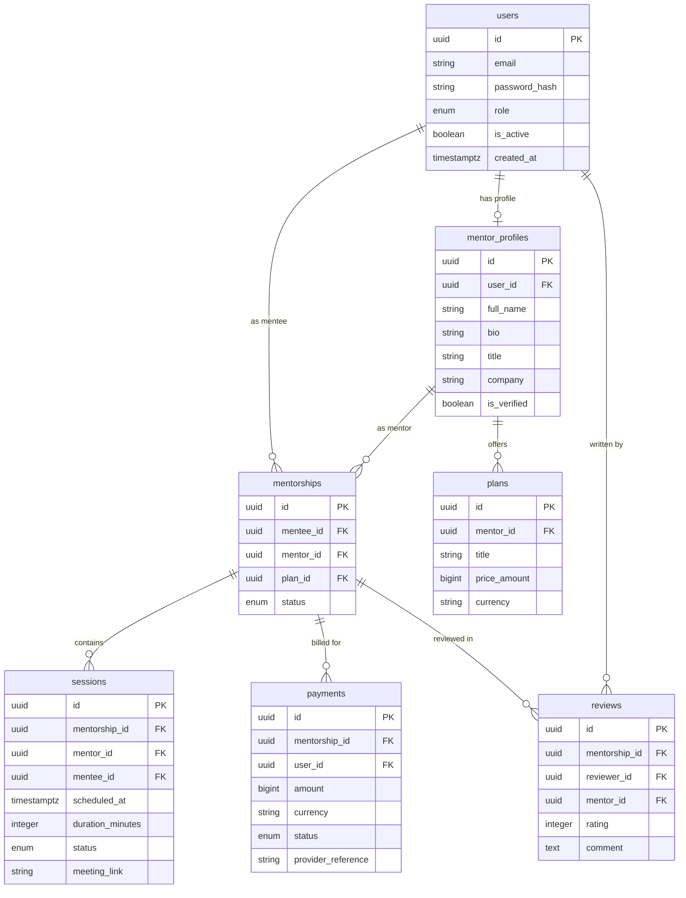

# Mentoraura Database Design Specification

## 1. Database Engine & Connection Details
- **Engine**: PostgreSQL (v15+)
- **Hosting / Provider**: Supabase (AWS eu-west-2)

### Connection Strings
- **Production**: Use `DATABASE_URL` (pooler) for application runtime and `DIRECT_URL` (pooler) for migrations.

---

## 2. Core Design Principles
1. **PostgreSQL as Source of Truth**: All domain state and constraints live in the database.
2. **UUID v4 Primary Keys**: Standardized across all entities using `gen_random_uuid()`.
3. **UTC Timestamps**: All temporal fields store `TIMESTAMPTZ` set to UTC (`DEFAULT CURRENT_TIMESTAMP`).
4. **Foreign-Key Integrity**: Explicit `ON DELETE RESTRICT` or `ON DELETE CASCADE` rules.
5. **Monetary Amounts**: Stored as `BIGINT` minor units (e.g., XAF / USD in smallest currency unit like cents/francs) to prevent floating-point rounding errors.
6. **Explicit Status Enums**: Enum types for status transitions (e.g., User Role, Session Status, Payment Status).
7. **No Critical Business State in Caches**: Redis is strictly for temporary caching and session locks.

---

## 3. Entity Relationship Diagram (ERD)

---

## 4. Tables Specification

### 4.1 `users`
| Column | Type | Constraints | Description |
|---|---|---|---|
| `id` | `UUID` | `PRIMARY KEY DEFAULT gen_random_uuid()` | Unique user identifier |
| `email` | `VARCHAR(255)` | `UNIQUE, NOT NULL` | User email address |
| `password_hash` | `VARCHAR(255)` | `NOT NULL` | Hashed password |
| `role` | `VARCHAR(32)` | `NOT NULL DEFAULT 'MENTEE'` | Enum: `'ADMIN'`, `'MENTOR'`, `'MENTEE'` |
| `is_active` | `BOOLEAN` | `NOT NULL DEFAULT true` | Account active flag |
| `created_at` | `TIMESTAMPTZ` | `NOT NULL DEFAULT CURRENT_TIMESTAMP` | Record creation timestamp |
| `updated_at` | `TIMESTAMPTZ` | `NOT NULL DEFAULT CURRENT_TIMESTAMP` | Record last updated timestamp |

### 4.2 `mentee_profiles`
| Column | Type | Constraints | Description |
|---|---|---|---|
| `id` | `UUID` | `PRIMARY KEY DEFAULT gen_random_uuid()` | Profile identifier |
| `user_id` | `UUID` | `UNIQUE, NOT NULL, FK -> users(id) ON DELETE CASCADE` | Associated user |
| `full_name` | `VARCHAR(255)` | `NOT NULL` | Mentee full display name |
| `avatar_url` | `VARCHAR(512)` | `NULLABLE` | Profile picture URL |
| `headline` | `VARCHAR(255)` | `NULLABLE` | Brief headline or current role |
| `goals` | `TEXT` | `NULLABLE` | Mentee learning goals and expectations |
| `interests` | `TEXT[]` | `NOT NULL DEFAULT '{}'` | Selected topic/skill interests for recommendations |
| `created_at` | `TIMESTAMPTZ` | `NOT NULL DEFAULT CURRENT_TIMESTAMP` | Record creation timestamp |
| `updated_at` | `TIMESTAMPTZ` | `NOT NULL DEFAULT CURRENT_TIMESTAMP` | Record update timestamp |

### 4.3 `skills`
| Column | Type | Constraints | Description |
|---|---|---|---|
| `id` | `UUID` | `PRIMARY KEY DEFAULT gen_random_uuid()` | Skill identifier |
| `name` | `VARCHAR(255)` | `NOT NULL` | Skill name (e.g. TypeScript, React) |
| `level` | `ENUM` | `NOT NULL DEFAULT 'BEGINNER'` | Skill level: `'BEGINNER'`, `'INTERMEDIATE'`, `'ADVANCED'`, `'EXPERT'` |
| `mentee_profile_id` | `UUID` | `NULLABLE, FK -> mentee_profiles(id) ON DELETE CASCADE` | Associated mentee profile |
| `mentor_profile_id` | `UUID` | `NULLABLE, FK -> mentor_profiles(id) ON DELETE CASCADE` | Associated mentor profile |
| `created_at` | `TIMESTAMPTZ` | `NOT NULL DEFAULT CURRENT_TIMESTAMP` | Record creation timestamp |
| `updated_at` | `TIMESTAMPTZ` | `NOT NULL DEFAULT CURRENT_TIMESTAMP` | Record update timestamp |

### 4.4 `mentor_profiles`
| Column | Type | Constraints | Description |
|---|---|---|---|
| `id` | `UUID` | `PRIMARY KEY DEFAULT gen_random_uuid()` | Profile identifier |
| `user_id` | `UUID` | `UNIQUE, NOT NULL, FK -> users(id) ON DELETE CASCADE` | Associated user |
| `full_name` | `VARCHAR(255)` | `NOT NULL` | Mentor full display name |
| `title` | `VARCHAR(255)` | `NOT NULL` | Professional title (e.g. Senior Software Engineer) |
| `company` | `VARCHAR(255)` | `NULLABLE` | Current company / organization |
| `bio` | `TEXT` | `NULLABLE` | Detailed mentor bio |
| `is_verified` | `BOOLEAN` | `NOT NULL DEFAULT false` | Verification badge status |
| `created_at` | `TIMESTAMPTZ` | `NOT NULL DEFAULT CURRENT_TIMESTAMP` | Record creation timestamp |
| `updated_at` | `TIMESTAMPTZ` | `NOT NULL DEFAULT CURRENT_TIMESTAMP` | Record update timestamp |

### 4.3 `plans`
| Column | Type | Constraints | Description |
|---|---|---|---|
| `id` | `UUID` | `PRIMARY KEY DEFAULT gen_random_uuid()` | Mentorship plan identifier |
| `mentor_id` | `UUID` | `NOT NULL, FK -> mentor_profiles(id) ON DELETE CASCADE` | Plan owner |
| `title` | `VARCHAR(255)` | `NOT NULL` | Plan title (e.g., 1-on-1 Monthly Mentorship) |
| `description` | `TEXT` | `NULLABLE` | Plan details |
| `price_amount` | `BIGINT` | `NOT NULL` | Price in minor units (e.g., cents or francs) |
| `currency` | `VARCHAR(10)` | `NOT NULL DEFAULT 'XAF'` | ISO currency code |
| `is_active` | `BOOLEAN` | `NOT NULL DEFAULT true` | Active listing status |
| `created_at` | `TIMESTAMPTZ` | `NOT NULL DEFAULT CURRENT_TIMESTAMP` | Creation timestamp |

### 4.4 `mentorships`
| Column | Type | Constraints | Description |
|---|---|---|---|
| `id` | `UUID` | `PRIMARY KEY DEFAULT gen_random_uuid()` | Mentorship engagement identifier |
| `mentee_id` | `UUID` | `NOT NULL, FK -> users(id) ON DELETE RESTRICT` | Mentee user |
| `mentor_id` | `UUID` | `NOT NULL, FK -> mentor_profiles(id) ON DELETE RESTRICT` | Mentor profile |
| `plan_id` | `UUID` | `NOT NULL, FK -> plans(id) ON DELETE RESTRICT` | Subscribed plan |
| `status` | `VARCHAR(32)` | `NOT NULL DEFAULT 'PENDING'` | `'PENDING'`, `'ACTIVE'`, `'COMPLETED'`, `'CANCELLED'` |
| `started_at` | `TIMESTAMPTZ` | `NULLABLE` | Start timestamp |
| `ended_at` | `TIMESTAMPTZ` | `NULLABLE` | Completion timestamp |
| `created_at` | `TIMESTAMPTZ` | `NOT NULL DEFAULT CURRENT_TIMESTAMP` | Creation timestamp |

### 4.5 `sessions`
| Column | Type | Constraints | Description |
|---|---|---|---|
| `id` | `UUID` | `PRIMARY KEY DEFAULT gen_random_uuid()` | Meeting session identifier |
| `mentorship_id` | `UUID` | `NOT NULL, FK -> mentorships(id) ON DELETE CASCADE` | Parent mentorship |
| `mentor_id` | `UUID` | `NOT NULL, FK -> mentor_profiles(id) ON DELETE RESTRICT` | Mentor |
| `mentee_id` | `UUID` | `NOT NULL, FK -> users(id) ON DELETE RESTRICT` | Mentee |
| `scheduled_at` | `TIMESTAMPTZ` | `NOT NULL` | Session start time |
| `duration_minutes` | `INTEGER` | `NOT NULL DEFAULT 60` | Duration in minutes |
| `status` | `VARCHAR(32)` | `NOT NULL DEFAULT 'SCHEDULED'` | `'SCHEDULED'`, `'COMPLETED'`, `'CANCELLED'`, `'NO_SHOW'` |
| `meeting_link` | `VARCHAR(512)` | `NULLABLE` | Google Meet / Zoom link |
| `created_at` | `TIMESTAMPTZ` | `NOT NULL DEFAULT CURRENT_TIMESTAMP` | Creation timestamp |

### 4.6 `payments`
| Column | Type | Constraints | Description |
|---|---|---|---|
| `id` | `UUID` | `PRIMARY KEY DEFAULT gen_random_uuid()` | Transaction identifier |
| `mentorship_id` | `UUID` | `NOT NULL, FK -> mentorships(id) ON DELETE RESTRICT` | Associated mentorship |
| `user_id` | `UUID` | `NOT NULL, FK -> users(id) ON DELETE RESTRICT` | Payer user |
| `amount` | `BIGINT` | `NOT NULL` | Transaction amount in minor units |
| `currency` | `VARCHAR(10)` | `NOT NULL DEFAULT 'XAF'` | ISO currency code |
| `provider` | `VARCHAR(32)` | `NOT NULL` | `'MTN_MOMO'`, `'ORANGE_MONEY'`, `'STRIPE'` |
| `status` | `VARCHAR(32)` | `NOT NULL DEFAULT 'PENDING'` | `'PENDING'`, `'SUCCESSFUL'`, `'FAILED'`, `'REFUNDED'` |
| `provider_reference` | `VARCHAR(255)` | `NULLABLE` | External transaction ID |
| `created_at` | `TIMESTAMPTZ` | `NOT NULL DEFAULT CURRENT_TIMESTAMP` | Creation timestamp |

### 4.7 `reviews`
| Column | Type | Constraints | Description |
|---|---|---|---|
| `id` | `UUID` | `PRIMARY KEY DEFAULT gen_random_uuid()` | Feedback rating identifier |
| `mentorship_id` | `UUID` | `NOT NULL, FK -> mentorships(id) ON DELETE CASCADE` | Associated mentorship |
| `reviewer_id` | `UUID` | `NOT NULL, FK -> users(id) ON DELETE RESTRICT` | Reviewer user |
| `mentor_id` | `UUID` | `NOT NULL, FK -> mentor_profiles(id) ON DELETE CASCADE` | Reviewed mentor |
| `rating` | `INTEGER` | `NOT NULL` | Rating value from 1 to 5 |
| `comment` | `TEXT` | `NULLABLE` | Written review content |
| `created_at` | `TIMESTAMPTZ` | `NOT NULL DEFAULT CURRENT_TIMESTAMP` | Creation timestamp |

---

## 5. Key Indexes
- `users(email)`
- `mentor_profiles(user_id)`
- `plans(mentor_id)`
- `mentorships(mentee_id, mentor_id)`
- `sessions(mentorship_id, scheduled_at)`
- `payments(mentorship_id, provider_reference)`
- `reviews(mentor_id)`

---

## 6. Migration Rules & Team Workflow
1. **Documentation Alignment**: Any schema change proposal begins with an update to `docs/database-design.md`.
2. **Version-Controlled Executable Migrations**: SQL migration files are generated in `prisma/migrations` (or raw SQL migration files) and committed to Git.
3. **Connection Standard**:
   - `DIRECT_URL` (Port 5432) MUST be used for running migrations.
   - `DATABASE_URL` (Port 6543 pooler) is used by NestJS runtime services.
4. **Pull Request Protocol**:
   - Step 1: Update `docs/database-design.md`
   - Step 2: Create executable migration
   - Step 3: Update NestJS Entity / Prisma schema
   - Step 4: Run integration & service tests
   - Step 5: Submit PR for team code review
